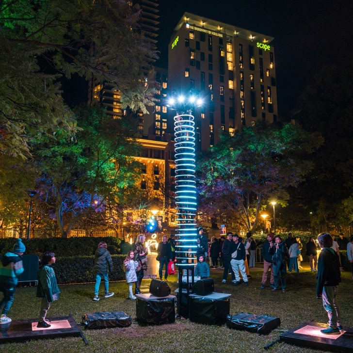

# A propos

Si vous avez déjà assisté à un concert, à une production théâtrale ou même si vous vous êtes simplement promené parmi les spectacles de lumière de votre mairie, vous avez probablement rencontré, sans le savoir, le monde des contrôleurs de lumière programmables.

Le [Groupe LAPS](https://groupe-laps.org) est un studio basé à Montreuil qui s'est spécialisé dans les spectacles artistiques de lumière et de son. Ils ont réalisé des installations dans toute la France et à l'international.

Votre mission consiste à créer le logiciel qui contrôle une telle installation d'éclairage, en gérant des milliers, voire des dizaines de milliers de LED adressables individuellement.

## Copyright

Copyright © Kevin Glass 2025.

La rédaction de ce programme a été faite par Kevin Glass, y compris la création des exemples, exercices, et données de test.

Merci au [Groupe LAPS](https://groupe-laps.org) pour sa collaboration et son soutien à ce projet !

Toute ré-utilisation du contenu de ce cours est sujet à l'accord exprès et à l'écrit de Kevin GLASS.

