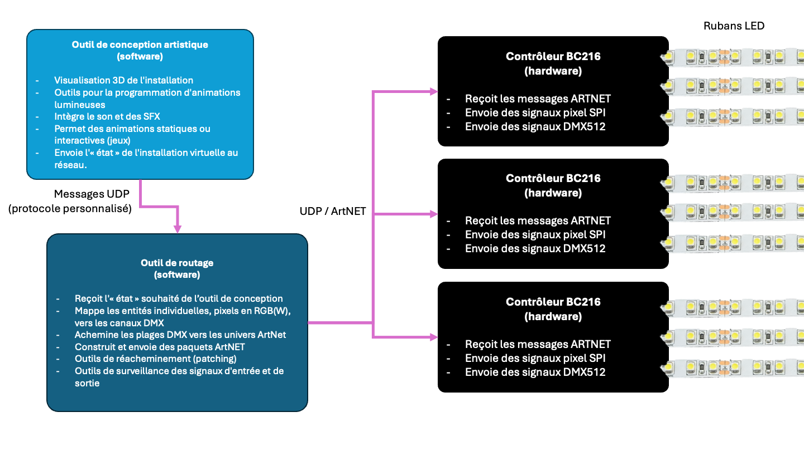

# Architecture globale

L'architecture d'une installation est la suivante :
- Un outil logiciel qui permet de visualiser l'installation et de créer des animations lumineuses. Cet outil émet un protocole personnalisé décrivant l'état de l'installation.
- Un outil logiciel qui « traduit » l'état de l'installation en signaux pouvant être reçus par du matériel physique. Il peut émettre plusieurs protocoles différents.
- Du matériel physique, généralement des contrôleurs tels que le BC216, qui convertissent les signaux entrants en impulsions correspondantes sur des bandes LED ou des appareils compatibles DMX.

Les chapitres suivants décrivent chaque élément individuellement.

## Installation réelle 

Dans une installation réelle, il y a au moins un PC déployé physiquement avec l'installation, qui exécute à la fois le simulateur et l'application de routage. Ce dispositif est généralement déployé dans un boîtier étanche sécurisé.

Dans les installations de très grande envergure, nous pouvons disposer de plusieurs PC, chacun exécutant une ou plusieurs applications, toutes communiquant entre elles via le réseau.