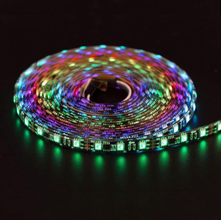
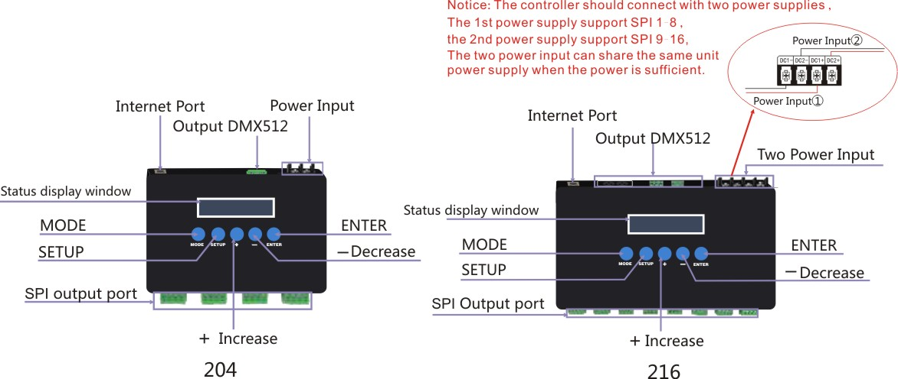
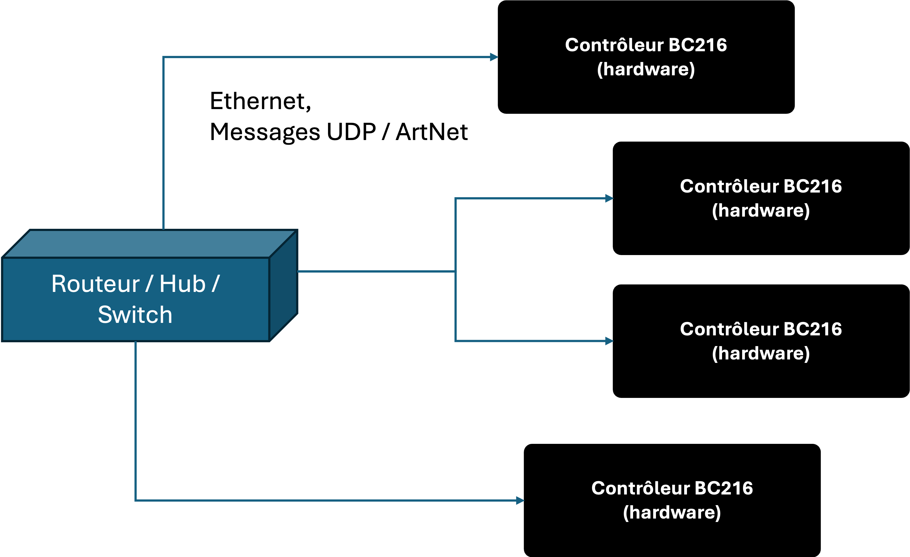

# L'installation Physique

Pour réaliser les installations lumineuses, le Groupe LAPS utilise des bandes LED programmables qui sont connectés aux alimentations et aux contrôleurs (par exemple BC216).

Le [BC216](https://www.rose-lighting.com/products/ethernet-spi-dmx-pixel-light-controller-bc216/) est un contrôleur physique qui reçoit les messages ArtNET du réseau et émet des signaux SPI vers des bandes de LED Pixel.

Chaque BC216 dispose de 16 bornes de sortie physiques. 

Chaque borne de sortie peut adresser jusqu'à 1024 canaux.

Cependant, qu'est-ce qu'un canal ? Un canal peut être considéré comme un circuit d'éclairage individuel pouvant avoir jusqu'à 256 niveaux d'intensité différents. Une valeur de 0 signifie que la lumière est éteinte, tandis qu'une valeur de 256 signifie que la lumière brille à pleine intensité.

Techniquement, chaque sortie peut donc contrôler 1 024 lumières individuelles.

Cependant, il est nécessaire de prendre en compte l'hétérogénéité des différents types de lumières :
- une lumière peut être monochrome (blanc uniquement), auquel cas un canal peut contrôler une lumière.
- une lampe colorée (RVB) contient en réalité 3 lampes différentes pour chaque canal de couleur. La couleur perçue par l'œil est en réalité un mélange des intensités de ces trois canaux. Cela signifie que nous avons besoin de 3 circuits pour contrôler une lampe colorée.
- parfois, nous pouvons ajouter un canal blanc à une lampe RVB, ce qui permet d'obtenir un blanc beaucoup plus intense. Cela ajoute un quatrième circuit pour contrôler une lampe.

En supposant que nous utilisons des bandes de LED RVB, cela signifie que nous pouvons adresser 1024/3 = 341 LEDs colorés via une seule sortie du BC216.

En réalité, une longue bande de LED nécessite une grande quantité d'énergie. Le BC216 est capable de fournir suffisamment d'énergie jusqu'à un certain point, mais il est généralement nécessaire d'ajouter une source d'alimentation supplémentaire. Pour plus de commodité, nous choisissons souvent d'adresser moins de LED sur une seule sortie afin d'éviter une configuration plus complexe nécessitant des sources d'alimentation externes. 

## Adressage - DMX512

Lorsque nous consultons les spécifications du BC216, nous constatons qu'il est basé sur [le protocole DMX512](https://en.wikipedia.org/wiki/DMX512).

Le DMX512 est un protocole populaire couramment utilisé pour l'éclairage et les effets. Il est devenu un protocole très standardisé dans de nombreux appareils d'éclairage et de sonorisation. Il est assez basique dans sa nature, dans la mesure où il permet de transmettre 512 informations.

Un réseau DMX512 est appelé « univers DMX ». Un univers DMX512 est composé de 512 canaux, chaque canal contenant une valeur comprise entre 0 et 255.

Étant donné que le BC216 peut adresser jusqu'à 1024 circuits par sortie, cela signifie qu'il utilise 2 univers DMX par sortie. En réalité, chaque univers peut contrôler 170 LEDs RVB (170 * 3 = 510).

Si, par exemple, nous souhaitons allumer la LED numéro 3 à pleine intensité, nous enverrions la valeur 256 au circuit 3 sur l'univers 1.

Si, par exemple, nous souhaitons allumer la LED numéro 520 à pleine intensité, nous enverrions la valeur 256 au circuit 8 sur l'univers 2.

## Adressage - ArtNet

Comment pouvons-nous configurer le BC216 pour qu'il allume différents circuits ?

Afin de simplifier et de standardiser les installations physiques, nous utilisons un réseau moderne qui effectue le travail à notre place.

Le BC216 est équipé d'une prise d'entrée Ethernet RJ45 et d'un serveur interne qui écoute les messages UDP de type ArtNet. Cela signifie que pour les installations de grande envergure, il suffit de connecter plusieurs BC216 au même commutateur réseau.

The BC216 also contains an internal admin panel allowing us to configure its network settings (for example, IP address, listening port, etc.).

Le BC216 comprend également un panneau d'administration interne qui nous permet de configurer ses paramètres réseau (par exemple, l'adresse IP, le port d'écoute, etc.).

Le [protocole ArtNet](https://en.wikipedia.org/wiki/Art-Net) permet d'envoyer des messages DMX512 via un réseau, en utilisant des messages UDP.

Il s'agit en fait d'une enveloppe DMX512 qui permet d'utiliser la pile réseau IP pour envoyer des paquets aux contrôleurs via des périphériques standardisés (routeurs, concentrateurs, etc.).

## Exemple

Imaginons que nous disposons de quatre contrôleurs BC216.

- Contrôleur 1, à l'écoute sur 10.0.0.1
- Contrôleur 2, à l'écoute sur 10.0.0.2
- Contrôleur 3, à l'écoute sur 10.0.0.3
- Contrôleur 4, à l'écoute sur 10.0.0.4

Chaque contrôleur dispose de 16 sorties, soit 32 univers au total.

Nous souhaitons afficher la couleur verte sur la LED 173 provenant de la sortie 3 du contrôleur 2.

Nous construirions un message UDP dont l'adresse IP de destination est 10.0.0.2. 

À l'intérieur de ce message, nous trouverions le format ArtNet, qui spécifie l'univers 5. **Pourquoi l'univers 5 ?** Veuillez noter que chaque sortie utilise deux univers pour adresser l'ensemble des 1024 canaux. Ainsi, la sortie 1 utilise les univers 0 et 1, la sortie 2 utilise les univers 2 et 3, et la sortie 3 utilise les univers 4 et 5, etc.

Si nous souhaitons adresser la LED 173 sur la bande, cela signifie que nous devons utiliser le deuxième univers de cette sortie (car un seul univers ne peut adresser que 170 LED RGB au maximum).

Par conséquent, l'univers de notre message ArtNet doit être défini sur 5. Cela signifie que nous allons adresser la 3e LED de ce deuxième univers (les 170 LED précédentes sont adressées à l'aide du numéro d'univers 4).

Il est maintenant nécessaire de déterminer quel canal utiliser dans les données DMX512 de notre message ArtNet.

Rappelons que chaque LED utilise 3 canaux (pour émettre les couleurs RVB). Par conséquent, l'intervalle des canaux utilisés par la 3e LED est compris entre 7 et 9, où le canal 7 spécifie la composante rouge, le canal 8 la composante verte et le canal 9 la composante bleue.

Ainsi, le 8e octet du payload DMX512 de notre message ArtNet contiendrait la valeur 256.

En résumé, le paquet ArtNet :

- IP cible : 10.0.0.2
- Univers : 5
- DMX (octets) : [0][0][0][0][0][0][0][256][0]

## Notes sur l'architecture

Comme vous pouvez le constater, l'adressage peut devenir très complexe pour les installations de grande envergure. Nous aurons besoin d'un outil pouvant être configuré pour acheminer les informations vers le contrôleur, l'univers et la LED appropriés.

En revanche, une personne dont le rôle est de concevoir des animations artistiques ne souhaite pas nécessairement se préoccuper de ce niveau de détail concernant le routage.

De plus, des défaillances peuvent survenir sur le terrain :

- Une panne totale du contrôleur BC216
- Une panne d'une sortie du BC216
- Une LED ou une série de LED sur une bande spécifique cesse de fonctionner en raison d'une connexion défectueuse

Nous ne souhaitons pas nécessairement modifier nos animations artistiques en raison de ce type de problème.

Par conséquent, notre architecture dissocie l'outil de création artistique de l'outil de routage.