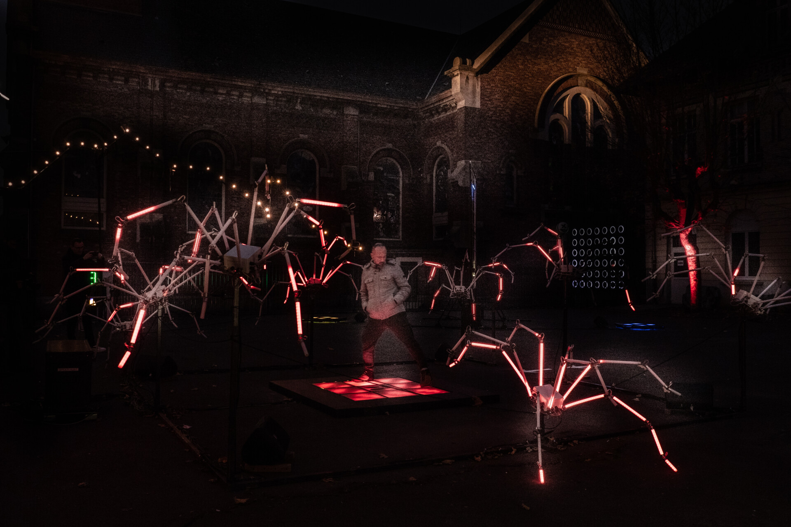
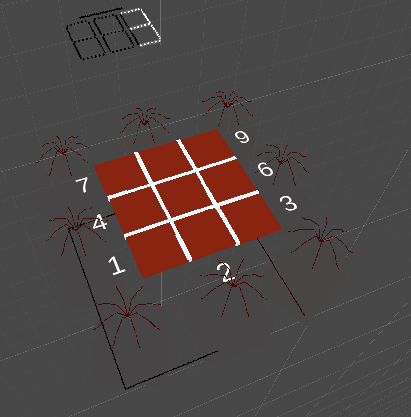
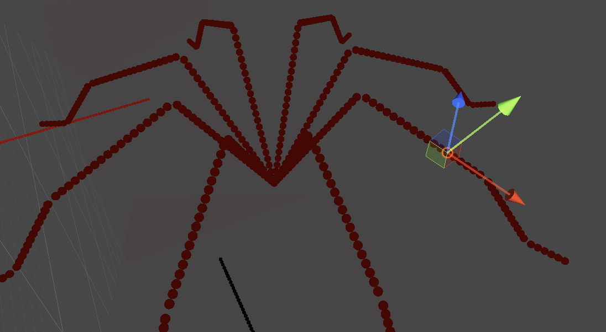
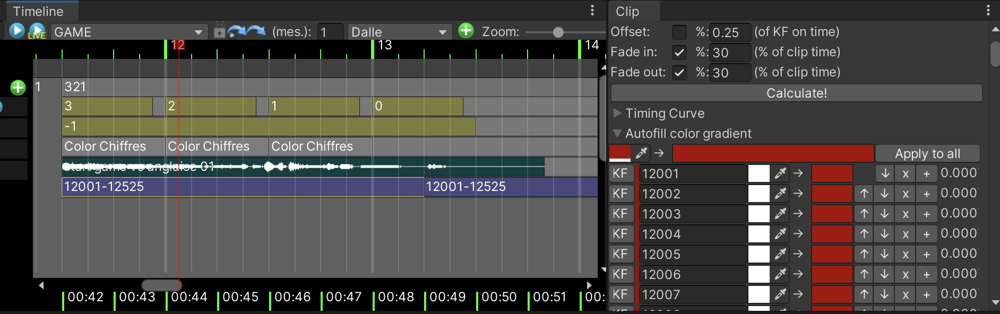
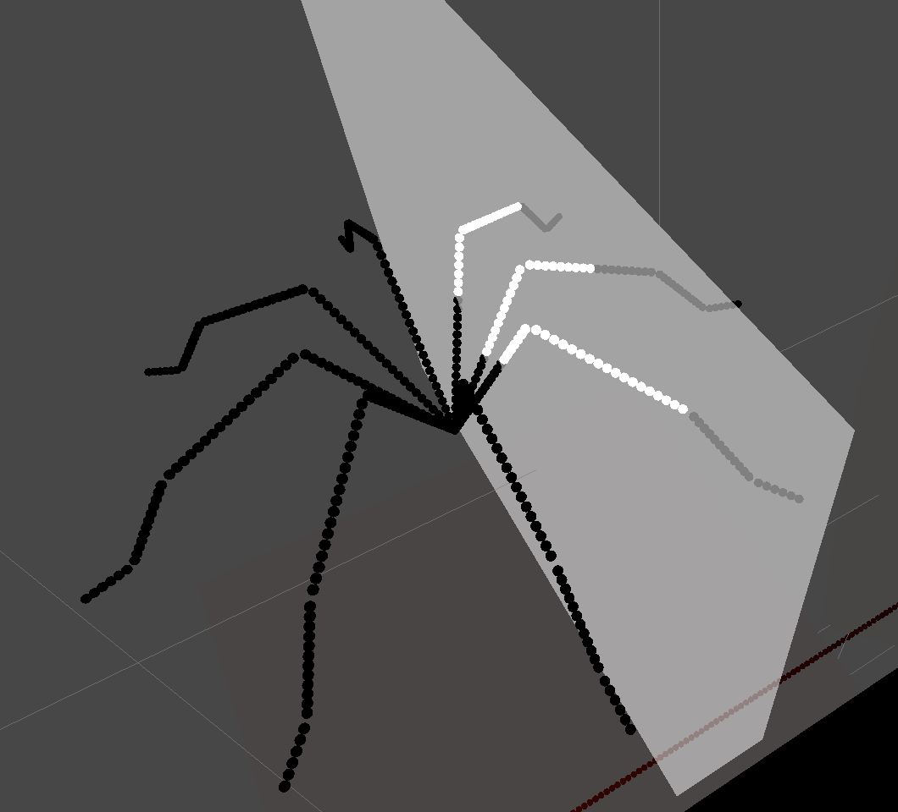

# Conception artistique

Comme décrit dans la section précédente, nous avons besoin d'un outil qui nous permette d'allumer nos milliers de LED sans nous soucier des adresses IP, des univers, etc.

Au sein du Groupe LAPS, les installations artistiques peuvent prendre de multiples formes.

Leurs KeyFrames emblématiques sont traditionnellement des figures monochromes qui utilisent un seul circuit pour s'illuminer.


Cependant, ils ont conçu des installations sous de nombreuses autres formes : araignées, arbres, vagues, grilles, etc.



Veuillez noter que si ce projet utilise une installation physique en deux dimensions qui ressemble à un écran classique, ce n'est jamais le cas des installations réelles du Groupe LAPS, qui sont toujours plus créatives et inspirées. Cela signifie qu'une simple projection vidéo en 2D n'est ni applicable ni pertinente.

Il est donc utile de disposer d'un outil permettant de modéliser l'installation réelle en 3D, qui comprend également des outils pour éclairer l'installation et fournir le son correspondant.

## Tan

Au fil des ans, un outil personnalisé, appelé « Tan », a été développé en tant qu'extension du moteur de jeu Unity.



Pourquoi Unity ?

- Il permet d'importer des modèles 3D de l'environnement d'installation et des représentations 3D de l'installation lumineuse.
- Tous les outils de navigation et d'édition courants sont déjà disponibles (hiérarchie des scènes, rendu, etc.).
- L'éditeur Unity est extensible, ce qui nous permet de créer des outils personnalisés pour la chronologie et l'animation.
- C# et .Net peuvent être utilisés pour envoyer l'« état » de l'installation virtuelle au réseau.
- L'aspect « jeu » de Unity permet également au Groupe Laps de créer des expériences interactives.

La version de Unity à utiliser pour ce projet est 2022.3.21. [Télécharger la version ici](https://unity.com/fr/releases/editor/whats-new/2022.3.21).

## Abstraction

Afin d'abstraire les concepts de routage, d'univers, de canaux, etc., la bibliothèque Tan est conçue autour de la notion d'« entité ».

Une « entité », ou « pixel » (les deux termes sont interchangeables), est une lumière RVB unique.

Chaque entité possède un identifiant numérique unique. Les identifiants ne doivent pas nécessairement être séquentiels, mais ils doivent être uniques.

Par exemple, imaginons que nous éclairons une araignée qui a 8 pattes. Nous savons que chaque patte sera constituée d'une bande de 170 LED. Chaque LED d'une bande est représentée dans Unity par une seule entité. Pour plus de commodité, nous pouvons utiliser la spécification suivante : 

- Patte 1 : entités 0 à 170
- Patte 2 : entités 200 à 370
- Patte 3 : entités 400 à 570
- Patte 4 : entités 600 à 770
- etc.



Veuillez noter que notre outil n'impose pas strictement la notion de bande de LED, de contrôleurs, etc. Il se contente d'attribuer un numéro unique à chaque source lumineuse possible et de représenter cette source lumineuse en 3D. Dans l'image ci-dessus, chaque LED est représentée par une sphère.

Les informations concernant le nombre de LED par jambe seront déterminées lors de la conception de l'installation physique (en dehors de Unity). Une fois que la configuration aura été décidée, les entités seront créées dans Unity.

Chaque entité possède son propre état interne, c'est-à-dire sa valeur RVB interne. Par défaut, cet état est noir, ou (0, 0, 0).

La bibliothèque Tan offre plusieurs façons de modifier l'état d'une ou plusieurs entités :
- Sur la timeline, nous pouvons ajouter des « clips » qui éclairent une ou plusieurs entités, identifiées par leur numéro d'entité. Dans l'image ci-dessous, le clip sélectionné attribue une couleur rouge aux entités numérotées de 12001 à 12525.



- Nous pouvons utiliser des « illuminateurs », qui sont des colliders dans Unity qui, lorsqu'ils entrent en collision avec une entité, lui transfèrent leur couleur. Dans l'image ci-dessous, un illuminateur éclaire une partie d'une araignée. Cela est très pratique, car nous n'avons qu'à animer la position de l'illuminateur, sans nous soucier des identifiants uniques des entités concernées.



- projecteurs
- ... etc.

## State

L'état interne de l'installation peut être représenté par une simple liste d'entités et leurs couleurs correspondantes à un instant donné. Voici une représentation schématique :

```
[
  { id: 1, color: (0, 0, 0) },
  { id: 5, color: (255, 0, 0) },
  { id: 6, color: (255, 255, 0) },
  { id: 7, color: (255, 0, 0) }
]
```

## Protocole EHub

Actuellement, un protocole personnalisé appelé « EHub » a été développé pour transmettre l'état d'une installation au réseau.

Il s'agit d'un protocole UDP qui envoie plusieurs messages par seconde. 

Le protocole comporte deux types de messages :
- le message « update »
- le message « config »

### Update

Ce message est envoyé à haute fréquence (40 fois par seconde) et contient les données RVB brutes pour toutes les LED de notre installation.

```
4 octets : 'eHuB'
1 octet : 2       // valeur 2 indique message de type "update"
1 octet : [le numero de l'univers eHuB à adresser]
2 octets : [nombre d'entités envoyés (unsigned short)]
2 octets : [taille du payload compressé (unsigned short)]
X octets : [payload compréssé avec GZip]
```

Le payload, avant compression, se compose d'une série de sextuors (6 octets, composé de 5 valeurs) : 

```
2 octets: id de l'entité (`unsigned short`, ou `ushort`)
1 octet : R
1 octet : V
1 octet : B
1 octet : W
```

Notez que la taille maximale d'un message UDP est d'environ 65 ko. Il est facile de dépasser cette limite.
Par conséquent, pour une installation de grande envergure, la série de mises à jour peut être envoyée à l'aide de plusieurs messages UDP.

### Config

Ce message, envoyé à une fréquence plus faible (une fois par seconde), détaille d'information concernant les entités. Étant donné que l'installation n'est pas censée changer souvent, cette fréquence est suffisante.

Le payload de ce message est composée d'une série de plages d'entités et de plages de positions dans le message `update`.

Ceci est optimisé en raison du fait que nous adressons souvent des plages d'entités qui correspondent à une bande LED. Dans notre exemple précédent avec l'araignée, nous avions :
- les entités 1 à 170
- les entités 200 à 370
- etc.

Lors de la construction d'un message `update`, les entités sont écrites dans l'ordre croissant de leurs ID. L'entité 1 est donc écrite dans les 4 premiers octets du payload, l'entité 2 dans les 4 suivants, etc.

Cependant, comme les numéros d'entités ne sont pas séquentiels, il y a un espace d'ID d'entités inutilisées (171 à 199). Pour économiser de la bande passante, l'entité 200 est donc écrite à la position disponible suivante, c'est-à-dire `171*6` (et non `200*6`).

Notre message de configuration est donc simplement une liste de plages. Une plage est décrit ainsi (8 octets, soit 4 `unsigned short`) :

```
2 octets: numéro du sextuor dans le payload (début de la plage)
2 octets: numéro d'entité (début de la plage)
2 octets: numéro du sextuor dans le payload (fin de la plage)
2 octets: numéro d'entité (fin de la plage)
```

Dans l'exemple des araignées :

```
// Plage 
0    // sextuor dans update (début)
1    // numéro d'entité
169  // sextuor dans update (fin)
170  // numéro d'entité

// Plage
170    // sextuor dans update (début)
200    // numéro d'entité
339    // sextuor dans update (fin)
370    // numéro d'entité

// etc
```

En français : les sextuors 0 à 169 contiennent les données pour les entités 1 à 170; les sextuors 170 à 339 contiennent les données pour les entités 200 à 370.

Le message `config` est composé comme suit : 

```
4 octets : 'eHuB'
1 octet : 1       // valeur 1 indique message de type "config"
1 octet : [ le numero de l'univers eHuB à adresser ]
2 octets : [ le nombre de plages dans le message ]
2 octets : [taille du payload compressé (unsigned short)]
X octets : [payload compréssé avec GZip]
```


## Notes sur l'architecture

Nous disposons d'un outil permettant de concevoir facilement une animation, et nous envoyons l'« état » de la simulation au réseau via le protocole « eHuB ».

Cependant, il nous manque une étape importante : l'interprétation du protocole « eHuB » et l'acheminement des états des entités vers les contrôleurs/univers/LEDs appropriés.