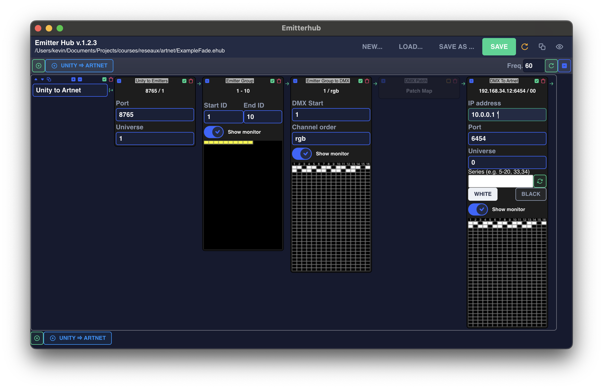
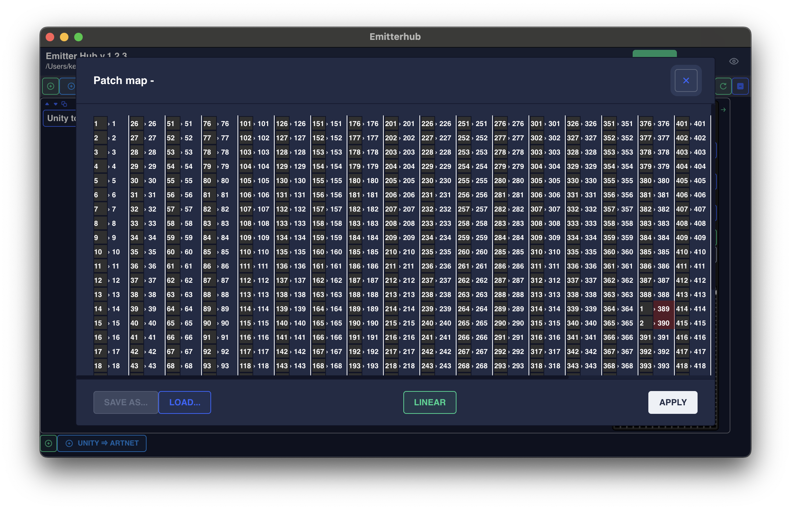

# Routage

Le module de routage assure la liaison entre nos logiciels de montage (Unity et Tan) et les contrôleurs BC216. 

Il a une fonction principale : assigner des entités à un contrôleur, à une sortie et à une LED.

**C'est le sujet principal de ce projet (P1)**.

Il existe actuellement une solution appelée « Emitter Hub », dont une capture d'écran est présentée ci-dessous :

Si vous regardez attentivement la capture d'écran, vous remarquerez que cela ressemble à un contrôle de flux basé sur les nœuds :

1. Le premier noeud « Unity to Emitters » écoute les messages UDP `eHuB`, à la fois `config` et `update`. Il émet un simple tableau d'entités et de leurs couleurs.
2. Le noeud « Emitter Group » sélectionne une gamme d'entités à partir de l'entrée, dans l'exemple nous n'utiliserons que les entités 1 à 10, en ignorant toutes les autres. Nous pourrions créer une deuxième ligne dans cette configuration pour router d'autres entités vers d'autres contrôleurs. Dans le *moniteur* en bas de ce nœud, nous pouvons voir que nous recevons la couleur jaune pour chaque entité.
3. Le nœud « Emitter Group to DMX » fait correspondre les couleurs reçues par la gamme d'entités à une série séquentielle de circuits DMX. Ce nœud permet de spécifier un décalage, et aussi de ne sélectionner que certains canaux parmi les couleurs d'entrée. Dans cet exemple, l'octet de départ est à la position 1, et nous allons sélectionner les canaux R, V et B des données d'entrée (notez que par défaut eHuB envoie également un canal W que nous ignorons ici). Vous pouvez voir dans le *moniteur* que 30 canaux DMX sont utilisés, 3 canaux par entité, et que seules les composantes R et G sont activées pour former le jaune.
4. Le noeud « DMX to ArtNet » empaquette le DMX produit par le noeud précédent, spécifie l'adresse IP du contrôleur cible, l'univers à cibler sur ce contrôleur. Le moniteur affiche ce qui est envoyé via ArtNe

L'idée sous-jacente à cette mise en œuvre basée sur les nœuds est de fournir un maximum de flexibilité :
- Nous pourrions éventuellement remplacer le nœud « Unity to Emitters » par un nœud qui reçoit un format différent, et convertit ce format en DMX.
- Nous pourrions utiliser un protocole différent d'ArtNet pour envoyer le DMX au matériel (par exemple, via un port USB).
- On peut manipuler le DMX dynamiquement entre deux nœuds, comme le montre le composant désactivé « Patch Map » qui permet de recâbler les circuits en fonction des incidents sur le terrain.
- On peut même ajouter des nœuds qui contournent complètement le DMX et utilisent des protocoles alternatifs (comme PixelLed).

## Problèmes actuels

Le « Emitter Hub » fonctionne correctement mais nous avons remarqué qu'il n'est pas adapté aux grandes installations.
- Vous avez peut-être remarqué que dans sa forme actuelle, une seule ligne est utilisée par plage d'entités. Cela devient vite encombrant et nécessite des centaines de lignes. 
- La configuration de chaque ligne individuelle est laborieuse à créer
- L'interface utilisateur dans sa forme actuelle ne peut pas faire face, en particulier lorsque les moniteurs sont actifs - et l'interface ralentit considérablement. 
- Le routage proprement dit, effectué dans un thread séparé, n'est pas optimisé et des problèmes sont parfois visibles dans l'installation physique.

## V2: Exigences

Vous trouverez ci-dessous une liste des conditions requises pour la V2 de ce logiciel de routage.

### E1 : Recevoir le protocole `eHub`

La nouvelle implémentation doit être capable de recevoir et d'interpréter les messages `update` et `config` entrants. 

Possibilité de spécifier le port d'écoute, et l'univers `eHuB` à écouter.

### E2 : Moniteur `eHuB` 

Afficher un suivi graphique en temps réel des messages `eHuB` reçus. Possibilité d'activer/désactiver ce moniteur.

### E3 : Correspondance entre les entités et les contrôleurs

Fournir un moyen à l'utilisateur de faire correspondre des entités à des contrôleurs et de cibler des univers et des LED spécifiques.

Le mappage doit être aussi configurable que possible : 
- Possibilité de sélectionner les canaux d'entrée à utiliser (RGBW, RGB, R, ...) et possibilité d'ignorer des canaux.
- Assignation d'entités à des plages de canaux dans la sortie DMX
- Configuration de(s) l’adresse(s) IP(s) de sortie
- Configuration des univers ArtNet

Vous pouvez utiliser n'importe quelle technique pour réaliser cette cartographie - qu'il s'agisse d'un système basé sur les nœuds, d'un système basé sur les lignes ou de toute autre technique que vous pouvez concevoir. L'important est la qualité de l'expérience de l'utilisateur lors de la mise en place d'une très grande installation.

N'ayez pas peur d'inclure des outils externes dans votre réflexion. Un moyen possible d'améliorer l'expérience des utilisateurs serait d'utiliser un tableau Excel pour spécifier la correspondance. Cela vaut-il la peine d'être exploré ?

### E4 : Acheminement

Mettre en œuvre le routage effectif de l'état `eHuB` entrant vers les contrôleurs.

Cela doit être aussi efficace que possible :

- en utilisant un minimum de mémoire grâce à une utilisation intelligente des structures de données.
- envoyer un nombre minimum de paquets ArtNet
- utiliser un minimum de ressources CPU
- s'adapter à de grandes installations

Idéalement, le routage devrait être effectué sur un thread séparé de l'interface utilisateur afin de ne jamais avoir de problèmes de performance liés au rendu de l'interface utilisateur.

### E5 : Moniteur DMX ou de sortie

Vous pouvez visualiser ce qui est envoyé par ArtNet aux contrôleurs, avec la possibilité de désactiver ou d'activer le moniteur à tout moment.

### E6 : Sauvegarde et chargement

Chaque installation est différente. L'utilisateur doit pouvoir sauvegarder une configuration et la recharger ultérieurement.

### E7 : Contrôle de la charge réseau

Une solution pour limiter la saturation du réseau est nécessaire. 
Typiquement, une première façon d'aborder ce problème est d'imposer une fréquence maximale d'envoi des messages ArtNet.

### E8 : Patching

Il arrive que les circuits de l'installation physique se rompent et que nous devions rapidement réacheminer les canaux sur le terrain.

Un patch-map nous permet de rediriger les circuits DMX.
Considérez l'image suivante.

Dans cette image, il y a un problème avec les circuits 1 et 2 qui ne fonctionnent plus dans l'installation physique. Imaginez que nous recâblions l'installation physique pour que les circuits 389 et 390 prennent la place des circuits 1 et 2.

Nous ne souhaitons pas reconfigurer l'ensemble de l'installation. Nous insérons donc un patch entre les plages DMX créées, mais avant d'envoyer le message ArtNet. Ce patch demande aux valeurs arrivant sur les circuits 1 et 2 d'être également émises sur les circuits 389 et 390. 

Ce fichier doit pouvoir être sauvegardé (idéalement sous forme d'Excel ou de CSV) et chargé. Nous devrions pouvoir décider d'appliquer le patch ou de l'ignorer.

### E9 : ArtNet Moniteur (facultatif - nice to have)

Idéalement, le logiciel devrait proposer un moyen de recevoir également des messages ArtNet et fournir un moniteur visuel qui affiche ce qui est reçu. 

Cela peut être très utile pour déboguer les installations et s'assurer qu'une autre instance du logiciel est correctement configurée.

### E10 : Entité faker (facultatif - nice to have)

Il peut être très utile de produire des messages `eHuB` directement dans le logiciel pour tester une configuration sans avoir à démarrer Unity.

Typiquement, ce module pourrait illuminer une gamme d'entités à une certaine couleur, ou illuminer une par une chaque entité en séquence. 