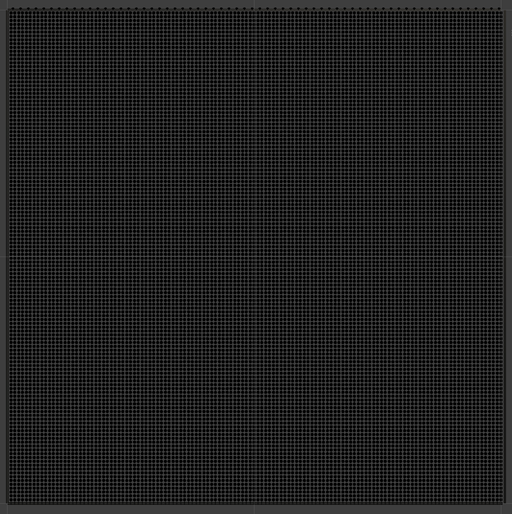

# Ecran LED

Votre cas de test est le mur LED fourni par le Groupe LAPS.

Ce mur est un cadre de 2 mètres sur 2 mètres, contenant 128 x 128 LEDs visibles, soit un total d'au moins 16 384 LED.

En réalité, il y a davantage de LED.

Le mur est composé de 64 bandes, chacune montant et descendant, composées de 259 LED.

Dans chaque colonne, la première LED sert à fixer la base de la bande au cadre et est invisible.

Il y a ensuite 128 LED visibles vers le haut.

La 129e LED est cachée et sert à fixer la bande en haut.

Les 128 LED suivantes vers le bas sont visibles.

La 259e LED sert à fixer l'extrémité de la bande à la base et est également invisible.

# Univers

Étant donné que chaque bande comporte plus de 170 LED, nous avons besoin de 2 univers pour représenter toutes les LED de la bande.

Pour la première bande :
- Les LED 1 à 170 sont représentées par l'univers 1
- Les LED 171 à 259 sont représentées par l'univers 2

Le reste suit jusqu'à ce que nous ayons 128 univers.

(Veuillez noter que dans ArtNet, les univers commencent à 0 !)

# Entités

Notre organisation logique des entités est la suivante :

La première ligne verticale commence à l'entité numéro 100 et se termine à 358, couvrant 2 univers.

La troisième ligne verticale commence à 400, la cinquième à 700, et ainsi de suite. Cela continue jusqu'à la ligne 31, qui commence à 4600 et se termine à 4858. 

Cela couvre le premier quart, soit 32 colonnes.

Le deuxième quart suit le même schéma, commençant à 5100 et se terminant à 9858.

Le troisième quart suit le même schéma, commençant à 10100 et se terminant à 14858.

| Entités | Univers | Adresses IP Contrôleur |
| ------- | ------- | ----------- |
| 100 - 4858 | 0 à 31 | 192.168.1.45 |
| 5100 - 9858 | 32 à 63 | 192.168.1.46 |
| 10100 - 14858 | 64 à 95 | 192.168.1.47 |
| 15100 - 19858 | 96 à 127 | 192.168.1.48 |

Le tableau complet est disponible [dans ce fichier Excel](https://dev.glassworks.tech/courses/led/simulator-unity/-/raw/main/Assets/Scenes/Ecran/eHub/Ecran.xlsx).

Pour se connecter à l'écran, il suffit de changer de réseau wifi :

- SSID : `GLASS_RESEAUX`
- Mot de passe : `networks`

A noter, il y a un projecteur attaché à l'installation aussi, connecté au contrôler à `192.168.1.45`, qui ecoute sur le premier 3 canaux de l'univers `200`. Vous pouvez peut-être utiliser ce projecteur pour tester vos premiers envois vers l'installation.

# Simulateur 3D - Unity

Un exemple de projet Unity est fourni ici :

[https://dev.glassworks.tech/courses/led/simulator-unity](https://dev.glassworks.tech/courses/led/simulator-unity)

Veuillez consulter le fichier README.md pour savoir comment configurer votre environnement Windows et lire la scène.

La version de Unity à utiliser pour ce projet est 2022.3.21. [Télécharger la version ici](https://unity.com/fr/releases/editor/whats-new/2022.3.21).
